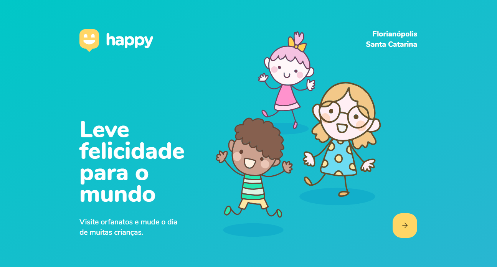
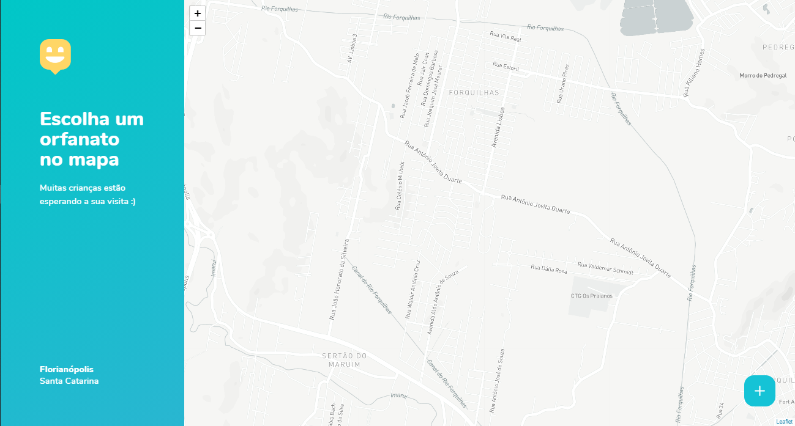

<h1 align="center" >
  
</h1>

<p align="center">Leve felicidade para o mundo, visite orfanatos e mude o dia de muitas crianças. NLW#3</p>

<p align="center">
 <a href="#dias">Dias</a> •
 <a href="#sobre">Sobre</a> •
 <a href="#layout">Layout</a> • 
 <a href="#tecnologias">Tecnologias</a> • 
 <a href="#web">Como usar a aplicação Web</a> • 
 <a href="#licenca">Licença</a> • 
 <a href="#autor">Autor</a>
</p>

<h2 id="dias"> :date: Dias </h2> 
<ul>
  <li>Dia 1: Acelerando sua evolução 12/10 - ✔️</li>
  <li>Dia 2: Olhando para as oportunidades 13/10 - ✔️</li>
  <li>Dia 3: A escolha da Stack 14/10 - :x:</li>
  <li>Dia 4: Até 2 anos em 2 meses 15/10 - :x:</li>
  <li>Dia 5: Milha extra 16/10 - :x:</li>
</ul>

---

<h2 id="sobre"> 💡 Sobre </h2> 

<p>Entre todas as funcionalidades dela temos o cadastro do orfanato sendo colocadas todas as informações de contato e de auxílio para caso a pessoa queira visitar ela já saiba onde e como fazer.</p>

<p>Essa aplicação está sendo construída durante a terceira edição da Next Level Week</a>

---

<h2 id="layout"> :art: Layout </h2>

<p align="center">
  

  
</p>

---

<h2 id="tecnologias"> 🛠️ Tecnologias </h2>

As ferramentas usadas no desenvolvimento do projeto.

#### Web:
- Typescript
- ReactJS 
- React Router Dom
- React Icons
- Leaflet 
- API do Mapbox 

#### Backend:
 - Typescript
 - NodeJS
 - Express
 - Express Async Errors
 - TypeORM
 - SQLite
 - Multer
 - Yup
 - Cors

#### Mobile:
> Em breve...

---

<h2 id="web"> :computer: Executando a aplicação Web </h2>

Entre na pasta

```bash

$ cd web

```
Instale as dependências

```bash

$ yarn

# ou, caso use npm

$ npm install

```

Rode a aplicação

```bash

$ yarn start

# ou, caso use npm

$ npm start

```
---

<h2 id="licenca"> :memo: Licença </h2> 

<p> O projeto está sob licença MIT </p>

---

<h2 id="autor"> :rocket:  Autor </h2>  

<p> Feito com :blue_heart: por Eduardo Perorck Ferraz </p>
